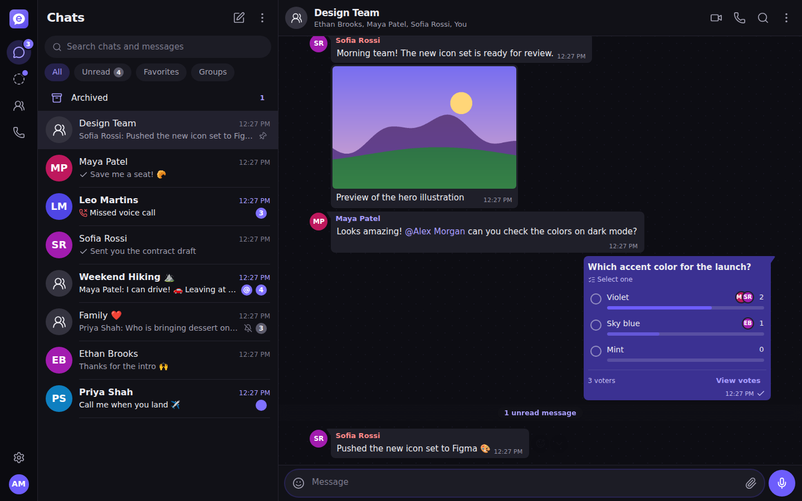
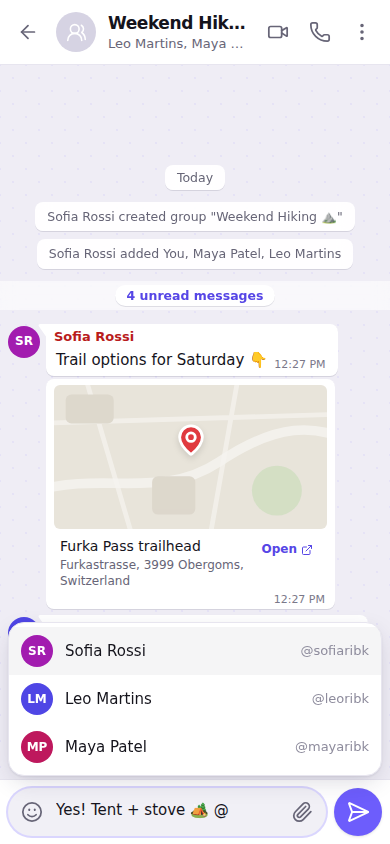
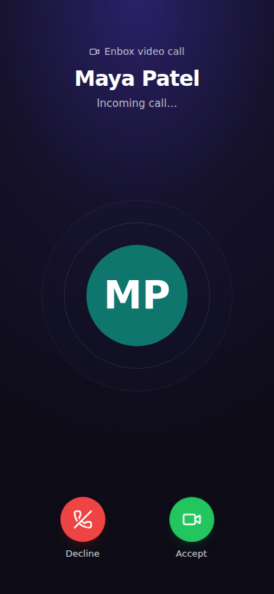
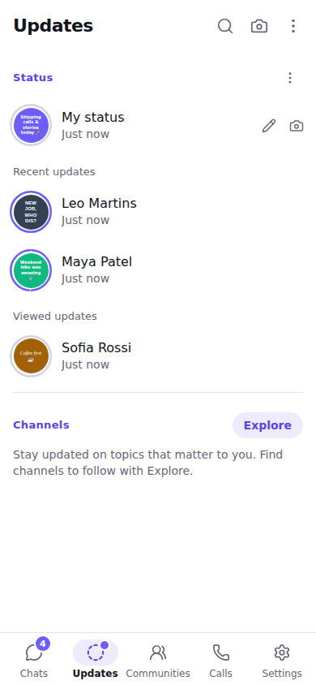
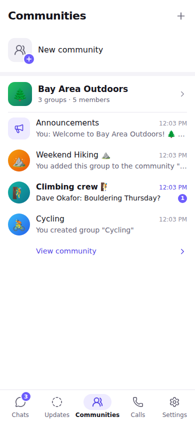

# Enbox

**Enbox** is a messenger in the spirit of WhatsApp and WeChat: private and group chats,
communities, channels, status updates, and voice/video calls (1:1 and group), in a
mobile-first web app that installs like a native app (PWA).

<p align="center">
  
</p>
<p align="center">
  
  
  
  
</p>

## Features

**Messaging**
- 1:1 chats, "Message yourself", group chats (up to 1,024 members)
- Text with formatting, links and @mentions; photos & videos (client-side compression,
  thumbnails, lightbox), voice notes (waveform, playback speed), audio, documents,
  location, contact cards, polls
- Replies (incl. "reply privately"), reactions, forwarding ("forwarded many times"),
  edit (15 min), delete for me / for everyone, star, pin (up to 3 per chat)
- Sent / delivered / read ticks, typing & recording indicators, online / last seen,
  message info (who read / received)
- Disappearing messages (24 h / 7 days / 90 days), clear / delete chat, archive, pin chats,
  mute, mark as unread, drafts, offline outbox (messages queue while offline)
- Global and in-chat message search with jump-to-message; starred messages

**Groups, communities & channels**
- Group roles (owner / admins / members), admin-only messaging, edit-info and add-member
  permissions, invite links (with reset), ownership transfer and automatic succession
- **Communities** (WhatsApp-style): an announcement group plus linked groups; members join
  groups from the community page; admin tools to link / unlink / create groups
- **Channels** (WhatsApp Channels / WeChat official accounts): one-to-many broadcast,
  discovery & search, follower privacy (followers never see each other), reactions and
  anonymous polls, public or invite-only

**Calls**
- 1:1 and group voice/video calls over WebRTC (full mesh, up to 8 participants)
- Multi-device ringing, busy / declined / missed handling, join ongoing group calls,
  invite more people, screen sharing, camera flip, mute, active-speaker highlight,
  automatic reconnect & rejoin, call history with missed-call badges
- STUN/TURN configuration with short-lived coturn credentials

**Status updates (stories)**
- Text (colours & fonts), photo and video statuses that expire after 24 h
- Viewer with progress bars, replies (sent as a quoted direct message) and reactions,
  viewer list, privacy (my contacts / my contacts except… / only share with…)

**Accounts & privacy**
- Sign up with username (+ optional phone), log in with username or phone
- Linked devices (sessions) with remote log-out; password change logs out other devices
- Privacy controls for last seen & online, profile photo, about, who can add me to groups,
  read receipts, silence unknown callers; blocking; account deletion
- Contacts, user search, profile photo cropping
- Web Push notifications (with previews toggle, dismiss-on-read), light / dark / system
  theme, wallpapers, font size

## Tech stack

| Layer | Technology |
| --- | --- |
| Monorepo | npm workspaces: `packages/shared`, `apps/server`, `apps/web` |
| Contracts | `@enbox/shared` — wire models, zod request schemas, REST route catalogue, Socket.IO event maps |
| Server | Node 22, Express 5, Socket.IO 4, Drizzle ORM, PostgreSQL (or embedded PGlite for zero-config dev) |
| Web | React 19, Vite, Tailwind CSS 4, React Router 7, Zustand, WebRTC, PWA (service worker + Web Push) |
| Tests | Vitest (server integration tests against a real database, web unit tests), Playwright end-to-end |

See [docs/ARCHITECTURE.md](docs/ARCHITECTURE.md) for the full design: data model, the
mutation → realtime-event matrix, membership transitions, receipts, privacy rules and the
call signaling protocol. The server services are documented in
[apps/server/src/services/README.md](apps/server/src/services/README.md) and the web client in
[apps/web/README.md](apps/web/README.md).

## Getting started

Requirements: **Node.js 22+** and npm. No database is needed for development: without
`DATABASE_URL` the server uses an embedded PostgreSQL (PGlite) stored in `apps/server/data/`.

```bash
npm install
npm run dev          # server on http://localhost:4000, web app on http://localhost:5173
```

Open http://localhost:5173, create an account, then open a second browser profile (or a
private window) to create another account and start chatting or calling.

To use a real PostgreSQL database, set `DATABASE_URL` (see [.env.example](.env.example)).
Migrations run automatically on startup.

### Useful scripts

| Command | What it does |
| --- | --- |
| `npm run dev` | Server (watch mode) + web client with hot reload |
| `npm run build` | Build the web client and the server bundle |
| `npm start` | Run the built server (also serves the built web client) |
| `npm test` | Server integration tests + web unit tests |
| `npm run e2e` | Playwright end-to-end tests (boots server + client automatically) |
| `npm run typecheck` / `npm run lint` | Type checking / ESLint across the monorepo |
| `npm run db:generate` | Generate a SQL migration after changing `apps/server/src/db/schema.ts` |

## Configuration

All server settings are environment variables, documented in [.env.example](.env.example).
The most important ones:

| Variable | Purpose |
| --- | --- |
| `DATABASE_URL` | PostgreSQL connection string (unset = embedded PGlite) |
| `PUBLIC_URL` | Public origin of the web app (used in invite links) |
| `CORS_ORIGINS` | Allowed browser origins |
| `STUN_URLS`, `TURN_URLS`, `TURN_SECRET` | WebRTC ICE servers; configure TURN for reliable calls behind strict NATs |
| `VAPID_PUBLIC_KEY`, `VAPID_PRIVATE_KEY` | Web Push (generate with `npx web-push generate-vapid-keys`) |
| `REDIS_URL` | Optional Socket.IO Redis adapter |

## Deployment

A production-like stack (Enbox + PostgreSQL + Redis + coturn) is provided:

```bash
cp .env.example .env    # set secrets: POSTGRES_PASSWORD, TURN_SECRET, VAPID keys, PUBLIC_URL
docker compose up -d --build
```

The `enbox` container serves the API, the realtime socket and the built web app on port 4000.
Put it behind HTTPS (required for camera/microphone access, service workers and push).

## Mobile apps

The web client is mobile-first and installable as a PWA ("Add to Home Screen"), with push
notifications and an offline app shell. For app-store builds it can be wrapped with
[Capacitor](https://capacitorjs.com/): build with `VITE_API_URL=https://your-server` so the
app talks to your API origin, then add the Android/iOS platforms.

## Testing

- **Server:** ~400 integration tests boot the real Express + Socket.IO server against a fresh
  in-memory database per file and cover every endpoint, realtime event ordering, privacy
  rules, permissions, concurrency (sequence allocation, idempotent sends) and the call
  state machine.
- **Web:** unit tests for stores, realtime merging, rich text, mentions, the WebRTC engine
  (mocked peer connections) and feature logic.
- **End-to-end:** Playwright drives multiple signed-in browser contexts against the real
  stack, including WebRTC calls with fake camera/microphone devices.

## Current limitations and roadmap

- Group calls use a full-mesh topology (up to 8 participants); an SFU (e.g. LiveKit or
  mediasoup) would be the path to larger calls.
- Presence, call state and per-user rate limits are kept in memory: v1 assumes a single
  server instance (the Redis adapter already fans out socket events across instances).
- Messages are protected in transit (HTTPS/WSS) but not end-to-end encrypted yet.
- Sign-up uses username + password; phone verification via SMS OTP is not implemented.
- No link previews yet.
